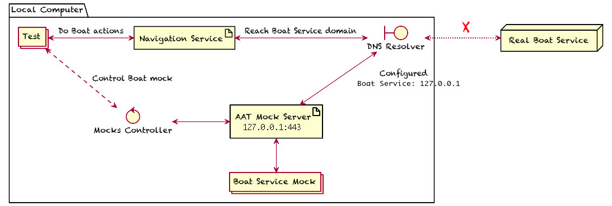
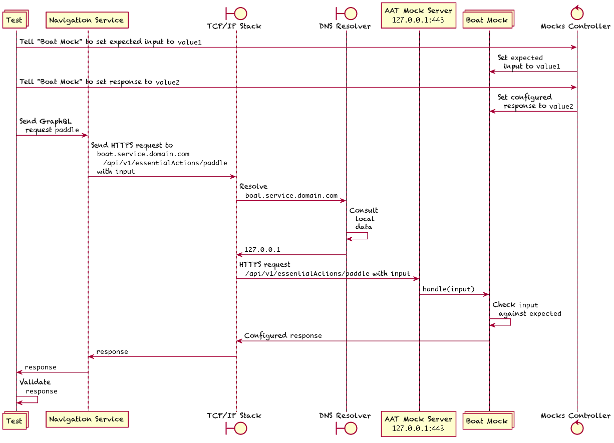

Mocking Framework
=================

# Introduction

This is a mocking framework to be used when you do not want to alter the navigation service's code when mocking its dependencies.

# Steps

To mock a dependency of the navigation service, we need to:

- Hijack the route to that dependency.
- Install a mock server that listens on the hijacked route.
- Control the mock server's behavior from inside the tests.

Below we assume the navigation service has a dependency called `https://dep.my.com/api/grind`.

# Hijack the Dependency's Route

Add a line to the `/etc/hosts` file:

    127.0.0.1 dep.my.com

# Run a Mock Server on the Hijacked Route

Run a server on `127.0.0.1:443`, as root.

Add to that server all the routes that we need to handle as part of the dependencies mocking.  This way we can handle a wide array of dependency calling methods:

- REST API calls: listen on `/api/grind`, allow all methods, check payload, and return a JSON response.

- GraphQL API calls: similar to REST, but check  GraphQL query payload.

- AWS Lambda calls: listen on `/2015-03-31/functions/my-func/invocations`, and return a response that matches the Lambda's one.

- Etc.

# Controlling the Mock Server's Behavior from Inside the Tests

Have controller interface that can be used from inside the tests that run as a separate process.  WebSockets is good for its flexibility.

# Topology

# Message Flow

